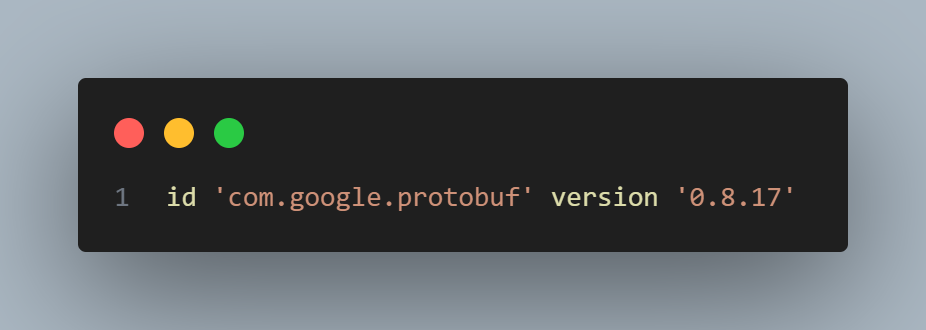
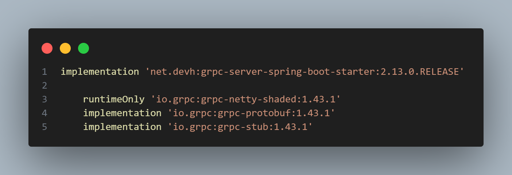
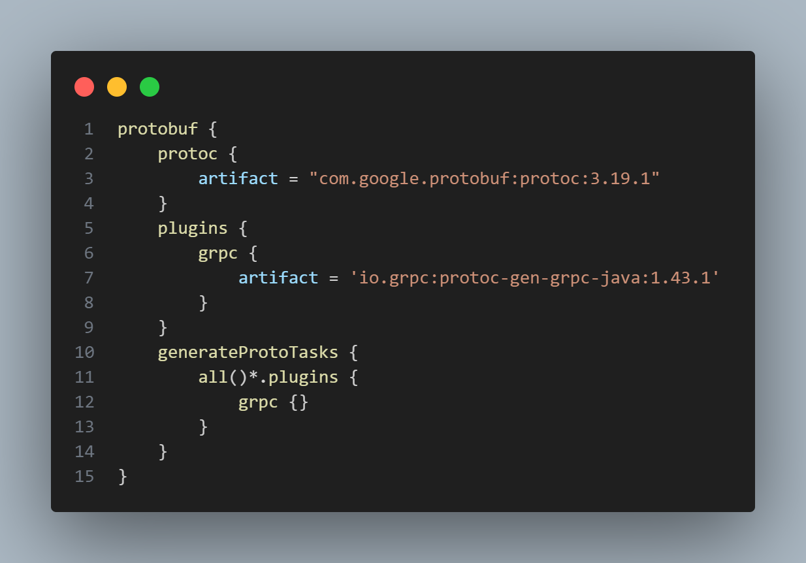
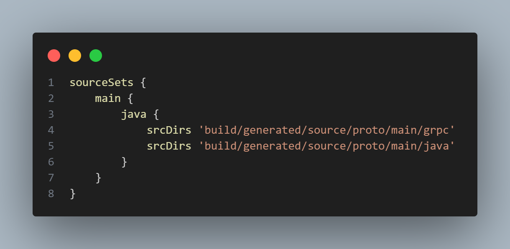

# Configuración completa - server

> **Nota:** Esta guía está centrada en la configuración del servidor. El proyecto demuestra cómo implementar y utilizar gRPC en Java 22 con Spring Boot y MySQL como base de datos, usando Gradle como herramienta de construcción. Además, para realizar pruebas, se empleará el software BloomRPC [que emula el cliente gRPC].

> 
# Índice

1. [Requisitos](#requisitos)
2. [Configuración de la Base de Datos](#configuración-de-la-base-de-datos)
   1. [Crea la Base de Datos](#crea-la-base-de-datos)
   2. [Configura el archivo `application.properties`](#configura-el-archivo-applicationproperties)
3. [Instalación de Gradle](#instalación-de-gradle)
   1. [Descargar e Instalar Gradle](#descargar-e-instalar-gradle)
   2. [Instalación Manual](#instalación-manual)
   3. [Configurar las Variables de Entorno](#configurar-las-variables-de-entorno)
   4. [Verificar la Instalación](#verificar-la-instalación)
   5. [Verifica la Configuración del Proyecto](#verifica-la-configuración-del-proyecto)
4. [Dependencias, Plugins y Configuración gRPC](#dependencias-plugins-y-configuración-grpc)
   1. [Agregar el Plugin de Protobuf](#agregar-el-plugin-de-protobuf)
   2. [Incluir las Dependencias Necesarias](#incluir-las-dependencias-necesarias)
   3. [Configurar Protocolo Buffer (Protobuf)](#configurar-protocolo-buffer-protobuf)
   4. [Especificar Directorios para Archivos Generados](#especificar-directorios-para-archivos-generados)
   5. [Compilar y Verificar](#compilar-y-verificar)

## 1 - Requisitos

- [Visual Studio Code (VSCode)](https://code.visualstudio.com/)
- [MySQL Workbench](https://www.mysql.com/products/workbench/)
- [BloomRPC](https://github.com/bloomrpc/bloomrpc) (para emular el cliente gRPC)
- [Java 22](https://www.oracle.com/java/technologies/javase-downloads.html) (o una versión compatible)
- [Gradle](https://gradle.org/install/) (para la construcción del proyecto)

## 2 - Configuración de la Base de Datos

2.1. **Crea la Base de Datos:**
   - Abre MySQL Workbench.
   - Crea una nueva base de datos según las necesidades de tu proyecto.

2.2. **Configura el archivo `application.properties`:**
   - Configura las credenciales y parámetros de conexión a tu base de datos en el archivo `application.properties` de tu proyecto.

## 3 - Instalación de Gradle

3.1. **Descargar e Instalar Gradle:**
   - Ve a [Gradle Releases](https://gradle.org/releases/).
   - Descarga la distribución más reciente (por ejemplo, `Gradle 8.9 Binary-Only`).

3.2. **Instalación Manual:**
   - Descomprime el archivo descargado en el directorio deseado. Por ejemplo, `C:/`.
   - Copia la dirección del directorio `bin` (por ejemplo, `C:\workspace\gradle-8.9-bin\gradle-8.9\bin`).

3.3. **Configurar las Variables de Entorno:**
   - Abre el Panel de Control y ve a `Sistema` > `Configuración avanzada del sistema` > `Variables de entorno`.
   - En `Variables del sistema`, encuentra la variable `Path`, selecciónala y haz clic en `Editar`.
   - Agrega la dirección del directorio `bin` que copiaste anteriormente a la lista de valores.
   - Guarda los cambios.

3.4. **Verificar la Instalación:**
   - Abre una consola (cmd o terminal) y ejecuta el comando:
     ```bash
     gradle -version
     ```
   - Deberías ver la versión de Gradle instalada si todo está configurado correctamente.
     
3.5. **Verifica la Configuración del Proyecto:**
   - Abre una consola en el directorio raíz del proyecto.
   - Ejecuta los siguientes comandos para limpiar y construir el proyecto:
     ```bash
     gradle clean
     gradle build
     ```
## 4 - Dependencias, Plugins y Configuración gRPC

Para integrar gRPC en tu proyecto, sigue estos pasos:

4.1. **Agregar el Plugin de Protobuf**

En tu archivo `build.gradle`, añade el plugin que se muestra en la siguiente imagen:



4.2. **Incluir las Dependencias Necesarias**

Añade las dependencias necesarias en la sección `dependencies` de tu archivo `build.gradle`, como se muestra en la imagen a continuación:



4.3. **Configurar Protocolo Buffer (Protobuf)**

Configura Protobuf en tu `build.gradle` para generar código Java a partir de archivos `.proto`. La configuración se muestra en la siguiente imagen:



4.4. **Especificar Directorios para Archivos Generados**

Define dónde se guardarán los archivos generados por Protobuf. Puedes ver esta configuración en la imagen:



4.5. **Compilar y Verificar**

Finalmente, ejecuta los siguientes comandos para limpiar y compilar el proyecto, asegurándote de que todo funcione correctamente:

```bash
gradle clean
gradle build
```


## Recursos Adicionales

- [Documentación de Gradle](https://docs.gradle.org/current/userguide/userguide.html)
- [Documentación de Spring Boot](https://spring.io/projects/spring-boot)
- [Documentación de gRPC](https://grpc.io/docs/)
- [Documentación de Protobuf](https://developers.google.com/protocol-buffers/docs/overview)
